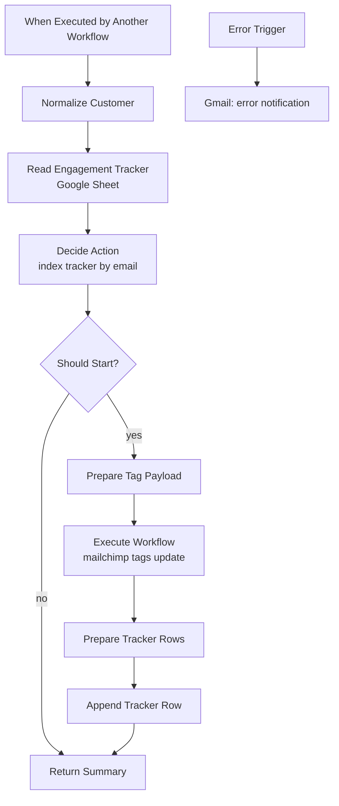

# Flow 4 — Fieldfolio Draft Order Recovery

n8n starts the recovery sequence by tagging the member. Mailchimp sends the
three emails and the delays between them. n8n never sends email in this flow.

## Boundary of responsibilities

| Concern                                       | Where |
|-----------------------------------------------|-------|
| Detect draft-order emails, parse names        | Phase-1 `Fieldfolio Draft orders sync` (untouched) |
| Match name to Fieldfolio customer + email     | Phase-1 sync (untouched) |
| Add member to Mailchimp audience              | Phase-1 `Mailchimp Sync` (untouched) |
| Decide whether recovery should start          | **This workflow** |
| Add / remove the recovery trigger tag         | `mailchimp tags update` (this branch) |
| Persist recovery state (start, step, status)  | **This workflow**, Google Sheet tracker |
| Send Email 1 / 2 / 3 and the delays           | Mailchimp Customer Journey |
| Detect conversion, remove tag, exit journey   | v2 reconciler (out of scope for v1) |

## Mailchimp Customer Journey (built once, by hand)

- **Trigger:** tag `Draft-Fieldfolio-Recovery` added
- **Steps:** Email 1 → Delay #1 → Email 2 → Delay #2 → Email 3 → End
- **Exit rule (global):** tag `Draft-Fieldfolio-Recovery` removed → skip
  remaining emails
- **Re-entry:** disabled (one active sequence per member)
- **Delays:** placeholder until copy is signed off, then tuned in Mailchimp
  without touching n8n

Because the journey exits on tag *removal*, the v2 reconciler only needs to
remove the tag when it detects an order — that alone stops any pending
emails.

## n8n workflow

`workflows/flow4_draft_order_recovery.json`, called by the phase-1
Fieldfolio workflow after `Match to Fieldfolio` succeeds.



### Input contract (from phase-1)

```json
{
  "accountNo":       "12345",
  "accountName":     "Example Business",
  "businessName":    "Example Business",
  "email":           "customer@example.com",
  "source":          "fieldfolio_draft_order",
  "sourceEmailId":   "gmail-message-id",
  "draftOrderDate":  "2026-08-27"
}
```

### Decisions and skip reasons

`Decide Action` reads the tracker in bulk once and classifies every input:

| Existing tracker row for this email      | Result | `_reason` |
|------------------------------------------|--------|-----------|
| none                                     | start  | `new-customer` |
| `Status = Active`                        | skip   | `already-active` |
| `Status = Converted`                     | skip   | `already-converted` |
| `Status = Unresponsive`                  | skip   | `previously-unresponsive` |
| `Status = Escalated`                     | skip   | `previously-escalated` |
| invalid email                            | skip   | `invalid-email` |

The re-entry policy for `Unresponsive` / `Escalated` is intentionally
strict for v1 — tighten or relax by editing this table only.

### Why the tag write goes through `mailchimp tags update`

Two things fall out for free:

1. The audience guard in `Diff Tags` fires if any Mailchimp node in that
   sub-workflow points at the wrong list — impossible to get silently
   wrong.
2. Steady-state runs where the tag is already on the member are no-ops
   (one read, no write), so re-runs of the same email cost nothing.

`Draft-Fieldfolio-Recovery` is deliberately **not** listed in the managed
vocabulary in `docs/mailchimp-tag-mutual-exclusion.md`. That means the
sync workflow will never remove it as a side effect of another run — only
an explicit remove call (v2 reconciler) can take it off. This is correct
for v1.

### Engagement Tracker sheet

Create a new Google Sheet `J Elliot Engagement Tracker`, tab
`Fieldfolio Draft Recovery`, columns (header row exactly as shown):

```
AccountNo, AccountName, Email, Flow, Step, Status,
LastEmailSent, LastOrderDate, RecoveryStartedAt, RecoveryCompletedAt,
Source, SourceEmailId, UpdatedAt
```

Then replace `REPLACE_WITH_TRACKER_SHEET_ID` in both Google Sheets nodes
with the sheet's document ID, and pick the `COndy` (or equivalent)
Sheets credential in the node UI.

## Build sequence

1. **Sheet** — create the tab and header row above.
2. **Mailchimp** — create the `Draft-Fieldfolio-Recovery` tag on
   audience `0d435a9df3` (add it to one dummy contact so the tag exists,
   then remove it).
3. **Mailchimp Journey** — build the trigger + 3 emails + exit rule
   above, keep it *paused* until copy is signed off.
4. **n8n** — import `workflows/flow4_draft_order_recovery.json`, fill in
   the sheet ID and credentials, save.
5. **Wire the caller** — in the phase-1 `Fieldfolio Draft orders sync`,
   after the existing `If` (email present) branch, add an
   `Execute Workflow` node targeting **this** workflow, passing the
   matched customer object. The existing `Execute Workflow - Mailchimp`
   call to `Mailchimp Sync` stays as-is (it seeds the member; this new
   call starts the recovery).
6. **Dry run** — disable `Add Recovery Tag via Sync` and execute with one
   pinned customer; inspect `Decide Action` output.
7. **Live run** — enable it against one disposable contact, activate the
   Mailchimp journey with test delays, watch Email 1 send.
8. **Ship** — replace test delays with business-approved values in
   Mailchimp; activate.

## What v2 will add (do not build now)

- Weekly reconciler: read tracker rows with `Status = Active`, cross-check
  the E-Suite cache's `LastOrderDate`, and for every converted customer
  call `mailchimp tags update` with **empty** tags for a new
  `flow4Recovery` group so the tag is removed. The journey exits by rule.
- Add the `flow4Recovery` group (`['Draft-Fieldfolio-Recovery']`) to the
  managed vocabulary in `docs/mailchimp-tag-mutual-exclusion.md` at that
  point — not before.
